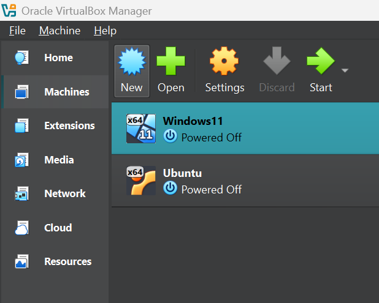

# Labbmiljö, Git, CLI och AI

Kurs: Introduktion till yrkesrollen och grunderna i IT-infrastruktur

Namn: Daniel Bergström

Datum: 2026-xx-xx

## Introduktion 
Här kommer jag att dokumentera arbetet med uppgiften Labbmiljö, Git, CLI och AI. 

## Labbmiljö och nätverk
Jag har skapat en labbmiljö med två virtuella maskiner i VirtualBox som är min hypervisor. Labbmiljön består av en Linux-server och en Windows-server. 

Jag har placerat båda servarna i ett gemensamt internt nätverk som jag döpt till LabNet. Jag har även gett dem statiska IP-adresser och placerat dem i samma subnät. Detta för att de ska kunna kommunicera enkelt med varandra utan att behöva gå via en router. 

### Statisk IP-adress i Ubuntu
Jag konfigurerade en statisk IP-adress på Ubuntu servern genom Netplan. Det jag gjorde var att stänga av DHCP och ändrade konfigurationen i nätverkskortet ´enp0s3´
 

### Statisk IP-adress i Windows 11
Jag konfigurerade även en statisk IP-adress på Windows severn genom Windows > Network & internet > Ethernet. Jag ändrade DHCP till manuell och ställde in IP-adress och subnätmasken.

Se tabell nedan: 

|Hostname|Operativsystem|IP-adress|Subnätmask|Standard Gateway|
|:---    |:---          |:---     |:---      |:---            |
|Ubuntu  |Linux         |192.168.50.23|255.255.255.0|Ingen|
|Windows11|Windows      |192.168.50.24|255.255.255.0|Ingen|